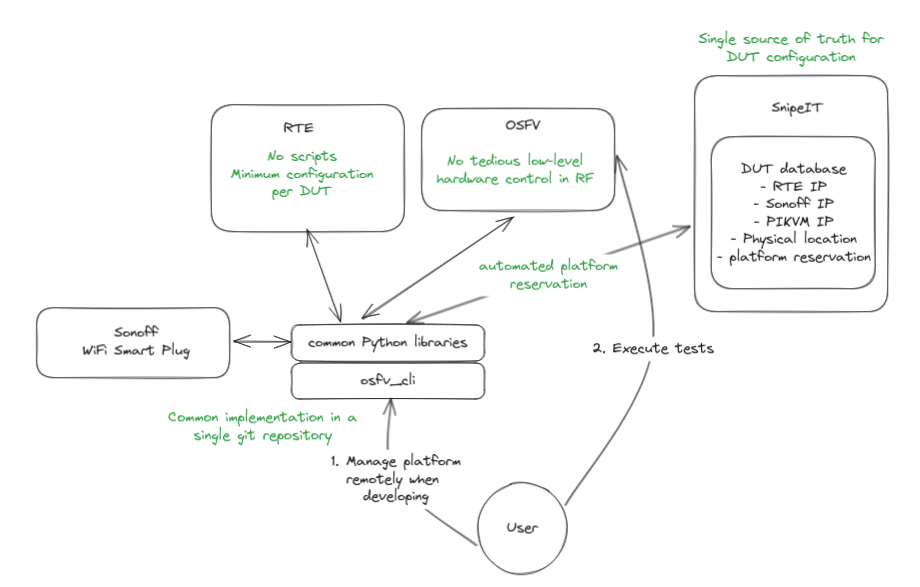
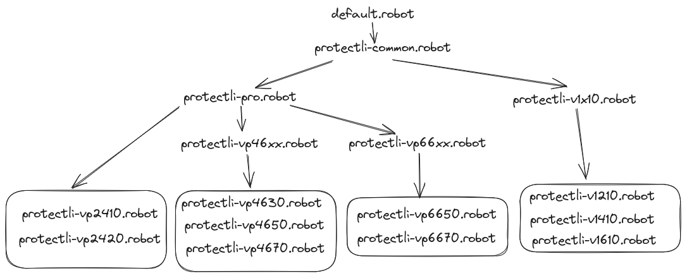
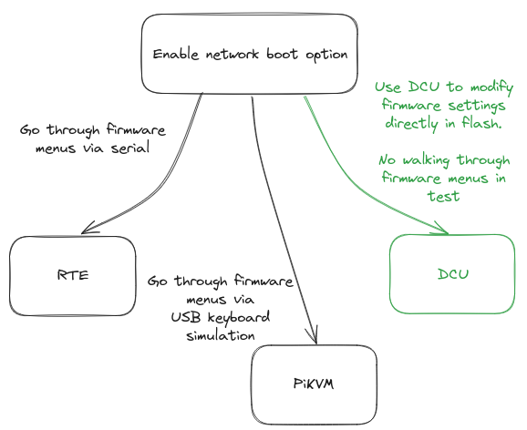

# Open Source Firmware Remote Test Environment

The following repository contains set of tests and other features to conduct
Dasharo firmware validation procedures.

## Warning

**!!! WARNING !!!**
This repository is in the process of migration and multiple major reworks. If
you do not know what you are doing, consider not using it until at least
`v0.5.0` is released. When this is scheduled, link to such a milestone will
appear here.
**!!! WARNING !!!**

## Table of contents

1. [Open Source Firmware Remote Test Environment](#open-source-firmware-remote-test-environment)
   1. [Warning](#warning)
   2. [Table of contents](#table-of-contents)
   3. [Lab architecture](#lab-architecture)
      1. [Current OSFV architecture](#current-osfv-architecture)
   4. [Test environment overview](#test-environment-overview)
   5. [Supported platforms](#supported-platforms)
   6. [DCU](#dcu)
   7. [Getting started](#getting-started)
      1. [Initializing environment](#initializing-environment)
      2. [Running tests](#running-tests)
      3. [Running tests via wrapper](#running-tests-via-wrapper)
      4. [Running tests with additional arguments](#running-tests-with-additional-arguments)
      5. [Running regression tests](#running-regression-tests)
      6. [Running regression tests with additional arguments](#running-regression-tests-with-additional-arguments)
   8. [Useful refactoring tools](#useful-refactoring-tools)
   9. [Generating documentation](#generating-documentation)
   10. [Additional documents](#additional-documents)

## Lab architecture

This graphic presents a rough overview on how DUT can be connected in the
Dasharo lab.

Following mechanisms may be used for DUT power control:
* [Sonoff WiFi smart plug](https://docs.dasharo.com/transparent-validation/sonoff/sonoff_preparation/)
* [RTE relay](https://docs.dasharo.com/transparent-validation/rte/introduction/)

Following mechanisms may be used for DUT control:
* serial port over telnet, exposed by [ser2net](https://github.com/cminyard/ser2net)
* [PiKVM](https://docs.dasharo.com/transparent-validation/pikvm/assembly-and-validation/)
  with USB keyboard emulatation
* for some platforms, a mixture of both (serial for output, PiKVM
  keyboard for input)


### Current OSFV architecture


Because of that the:
* [3mdeb/sonoff-rest-api](https://github.com/3mdeb/sonoff-rest-api)
* [3mdeb/rte-ctrl-rest-api](https://github.com/3mdeb/rtectrl-rest-api)

repositories were replaced by common libraries such as those contained [here](https://github.com/Dasharo/osfv-scripts/tree/main/osfv_cli/src/osfv/libs).
These and robot framework libraries (found [here](https://github.com/Dasharo/osfv-scripts/tree/main/osfv_cli/src/osfv/rf))
are attached to the environment itself via `requirements.txt` which needs to be
kept up to date to serve its purpose.

## Test environment overview

Dasharo OSFV consists of following modules:
* `dasharo-compatibility`,
* `dasharo-security`,
* `dasharo-performance`,
* `dasharo-stability`.

## Supported platforms

This table presents platform names along with their config names from
`platform-configs` directory. The support level (which test are supported per
different platform) may vary.

| Manufacturer | Platform             | Firmware                 |  $CONFIG                               |
|--------------|----------------------|--------------------------|----------------------------------------|
| MSI          | PRO Z690 A DDR5      | Dasharo                  |  `msi-pro-z690-a-ddr5`                 |
| MSI          | PRO Z690 A WIFI DDR4 | Dasharo                  |  `msi-pro-z690-a-wifi-ddr4`            |
| NovaCustom   | NS50MU               | Dasharo                  |  `novacustom-ns50mu`                   |
| NovaCustom   | NS50PU               | Dasharo                  |  `novacustom-ns50pu`                   |
| NovaCustom   | NS70MU               | Dasharo                  |  `movacustom-ns70mu`                   |
| NovaCustom   | NS70PU               | Dasharo                  |  `novacustom-ns70pu`                   |
| NovaCustom   | NV41MB               | Dasharo                  |  `novacustom-nv41mb`                   |
| NovaCustom   | NV41MZ               | Dasharo                  |  `novacustom-nv41mz`                   |
| NovaCustom   | NV41PZ               | Dasharo                  |  `novacustom-nv41pz`                   |
| NovaCustom   | V540TND              | Dasharo                  |  `novacustom-v540tnd`                  |
| NovaCustom   | V540TU               | Dasharo                  |  `novacustom-v540tu`                   |
| NovaCustom   | V560TND              | Dasharo                  |  `novacustom-v560tnd`                  |
| NovaCustom   | V560TNE              | Dasharo                  |  `novacustom-v560tne`                  |
| NovaCustom   | V560TU               | Dasharo                  |  `novacustom-v560tu`                   |
| PC Engines   | apu4                 | Dasharo                  |  `pcengines-apu4`                      |
| Protectli    | V1210                | Dasharo                  |  `protectli-v1210`                     |
| Protectli    | V1410                | Dasharo                  |  `protectli-v1410`                     |
| Protectli    | V1610                | Dasharo                  |  `protectli-v1610`                     |
| Protectli    | VP2410               | Dasharo                  |  `protectli-vp2410`                    |
| Protectli    | VP2420               | Dasharo                  |  `protectli-vp2420`                    |
| Protectli    | VP4630               | Dasharo                  |  `protectli-vp4630`                    |
| Protectli    | VP4650               | Dasharo                  |  `protectli-vp4650`                    |
| Protectli    | VP4670               | Dasharo                  |  `protectli-vp4670`                    |
| QEMU         | Q35                  | Dasharo (UEFI)           |  `qemu`                                |
| Raptor-CS    | TalosII              | Dasharo                  |  `raptor-cs_talos2`                    |
| Raspberry Pi | RaspberryPi 3B       | Yocto                    |  `rpi-3b`                              |

`platform-configs` has recently been reworked- by using the tree
topology to group platforms by more generic settings up above and the
 more specific flags and settings much lower down to an exact platform
  model. Example:


## DCU

The osfv uses the
[Dasharo Configuration Utility](https://github.com/Dasharo/dcu?tab=readme-ov-file#dasharo-configuration-container),
 it lets you set firmware settings directly in binary file.


## Getting started

### Initializing environment

* Clone repository and setup virtualenv:

```bash
git clone https://github.com/Dasharo/open-source-firmware-validation
cd open-source-firmware-validation
git submodule update --init --checkout
python3 -m virtualenv venv
source venv/bin/activate
```

* Install modules (in case of Raptor Talos II platform):

```bash
pip install -U -r requirements-openbmc.txt
```

* Install modules (in case of other platforms):

```bash
pip install -r requirements.txt
```

* If you try to run the environment again after the first initialization
  you must reinstall requirements.txt for it to work properly:

```bash
python3 -m virtualenv venv
source venv/bin/activate
pip install -r ./requirements.txt
```

* Or just create an alias:

```bash
alias penv="python3 -m virtualenv venv && source venv/bin/activate && pip install -r ./requirements.txt"
```

> NOTE: `keywords.robot` requires osfv_cli to be installed on the host system.
> Go through [these
> steps](https://github.com/Dasharo/osfv-scripts/tree/main/osfv_cli#installation)
> to configure the scripts

* Executing manual steps require that tkinter module be installed which can't be
done via pip

```bash
sudo dnf install python3-tkinter
```

### Running tests

When running tests on Dasharo platforms use the following commands:

* For running a single test case:

```bash
robot -L TRACE -v rte_ip:$RTE_IP -v config:$CONFIG -v device_ip:$DEVICE_IP \
-t $TEST_CASE_ID $TEST_MODULE/$TEST_SUITE
```

* For running a single test suite:

```bash
robot -L TRACE -v rte_ip:$RTE_IP -v config:$CONFIG -v device_ip:$DEVICE_IP \
$TEST_MODULE/$TEST_SUITE
```

* For running a single test module:

```bash
robot -L TRACE -v rte_ip:$RTE_IP -v config:$CONFIG -v device_ip:$DEVICE_IP \
$TEST_MODULE
```

Parameters should be defined as follows:

* $DEVICE_IP - IP address of the DUT. Required only when there is no serial
  input enabled for the device, or tests are executed over SSH. Currently, this
  is the case for NovaCustom and MSI devices.
* $RTE_IP - IP address of the RTE. Required only if RTE is used on a given test
  stand.
* $FW_FILE - path to and name of the coreboot firmware file. This is usually
  not required when running single tests or suites, where flashing is not
  necessary.
* $CONFIG - platform config - see the `platform-configs` directory for
  available configurations.
* $TEST_MODULE - name of the test module (i.e. `dasharo-compatibility`),
* $TEST_SUITE - name of the test suite (i.e. `uefi-shell.robot`),
* $TEST_CASE_ID - ID of the requested to run test case (i.e. `CBP001.001*`).
  Note that after test case ID asterisk should be added, if you do not wish
  to provide the full test name here.

You can also run tests with `-v snipeit:no` in order to skip checking whether
the platform is available on snipeit and fetching data from the asset page.
By default, this is enabled. Mind that if you choose to skip you may need to
provide the following parameters:

* $SONOFF_IP - IP of the Sonoff device. Required if the DUT uses Sonoff for
power control.
* $PIKVM_IP - IP of PiKVM. Required if the DUT's connection method is PiKVM.

The command below is an example of how to run tests without using SnipeIT on a
platform that uses both Sonoff and PiKVM:

```bash
robot -L TRACE -v snipeit:no -v rte_ip:$RTE_IP -v config:$CONFIG \
-v device_ip:$DEVICE_IP -v sonoff_ip:$SONOFF_IP -v pikvm_ip:$PIKVM_IP \
$TEST_MODULE
```

### Running tests via wrapper

Test can be run directly via `robot` command, but also via the `run.sh`
wrapper:

```bash
DEVICE_IP=$DEVICE_IP RTE_IP=$RTE_IP CONFIG=$CONFIG ./scripts/run.sh $TEST_SUITE
```

Running tests without snipeit requires additional variables:

```bash
DEVICE_IP=$DEVICE_IP RTE_IP=$RTE_IP CONFIG=$CONFIG SNIPEIT_NO="y" \
SONOFF_IP=$SONOFF_IP PIKVM_IP=$PIKVM_IP
./scripts/run.sh $TEST_SUITE
```

Mind that `SNIPEIT_NO`, only need to be set, meaning that whatever value it
has, it will be treated as true.

### Running tests with additional arguments

Any additional parameters to `robot` can be passed using the wrapper by giving
them after a separator '--'. The arguments can be anything that `robot` accepts.
For example: specifying the tests to perform by giving a test case ID and
reducing the output verbosity:

```bash
DEVICE_IP=$DEVICE_IP RTE_IP=$RTE_IP CONFIG=$CONFIG ./scripts/run.sh $TEST_SUITE -- -t $TEST_CASE_ID --quiet
```

### Running regression tests

Regression tests involve running all OSFV tests supported by the given
platform. The support for certain tests is indicated by the flags in the
platform config file.

```bash
FW_FILE=$FW_FILE DEVICE_IP=$DEVICE_IP RTE_IP=$RTE_IP CONFIG=$CONFIG ./scripts/regression.sh
```

Running regression tests without snipeit works the same way as
[running regular tests](#running-tests-via-wrapper).

### Running regression tests with additional arguments

Giving additional arguments to `robot` can be done in the same way as in `run.sh`.
Example: running only minimal regression tests with given test ID and reduced verbosity:

```bash
FW_FILE=$FW_FILE DEVICE_IP=$DEVICE_IP RTE_IP=$RTE_IP CONFIG=$CONFIG ./scripts/regression.sh -- --include "minimal-regression" -t "BMM*" --quiet
```

## Useful refactoring tools

* [sherlock](https://github.com/MarketSquare/robotframework-sherlock)
    - can detect unused keywords, and much more
* [Renaming keywords](https://robotidy.readthedocs.io/en/stable/transformers/RenameKeywords.html)
* [Renaming Test Cases](https://robotidy.readthedocs.io/en/stable/transformers/RenameTestCases.html)
* [Renaming Variables](https://robotidy.readthedocs.io/en/stable/transformers/RenameVariables.html)

## Generating documentation

Keywords documentation (Develop) deploy status: 

Documentation in the form of auto-generated html documents can be created using
`libdoc` and `testdoc`.

Note: you should be in your python virtual environment. If you haven't
created any, please refer to [Getting Started](#getting-started)

To generate a document for a resource file
containing keywords, use these commands:

```bash
$(venv) libdoc keywords.robot keywords.html
```

Or in more general form:

```bash
$(venv) libdoc <file-with-keywords> <output filename>
```

The output file can be opened in any web-browser like so:

```bash
$ firefox keywords.html
```

Or use the provided `create-docs.sh` script, which automatically concatenates
all of the keyword-containing libraries from `lib/` directory with
`keywords.robot`, and generates one big html file containing all the
keywords within this repo.

It also allows to choose the version of the
documentation, which basically decides if you want to perform the UEFI
configuration via "UEFI setup app" (`UEFI`) or via "Dasharo Config
Utility tool" (`DCU`):

```bash
$ ./scripts/create-docs.sh UEFI
Generating UEFI version of the documentation
Documentation generated and saved as all-keywords.html
$ firefox all-keywords.html
```

Or

```bash
$ ./scripts/create-docs.sh DCU
Generating DCU version of the documentation
Documentation generated and saved as all-keywords.html
$ firefox all-keywords.html
```

The resulting file can be opened in any web-browser:

```bash
$ firefox docs/index.html
```

To generate documentation regarding a specific test, `testdoc` has to
be used, for example if we want documentation regarding the
`dasharo-compatibility/dasharo-tools-suite.robot` test, these commands would
need to be executed:

```bash
$ python3 robot.testdoc dasharo-compatibility/dasharo-tools-suite.robot test.html
$ firefox test.html
```

[This website](https://dasharo.github.io/open-source-firmware-validation/) shows
the current state of all keywords from all libraries as they appear right now on
the `develop` branch. It works by utilizing a workflow, so remember that local
changes that are made won't show up there, until they are pushed to the `develop`
branch.

## Additional documents

* [Adding new platforms](docs/adding-new-platforms.md) - Instructions for adding
  support for new platforms
* [Contributing](docs/contributing.md) - Instructions for first-time
  contributors
* [Raptor CS Talos II](docs/raptor-talos-2.md) - Documentation specific to the
  Raptor Computing Systems Talos II mainboard
* [QEMU](docs/qemu.md) - Documentation for running tests in QEMU
* [NovaCustom](docs/novacustom.md) - Documentation for running tests on
  NovaCustom laptops
* [Config parser](docs/config-parser.md) - Instructions for the
  `scripts/config-parser.py` utility for parsing coreboot config files into
  .robot platform configs for OSFV
