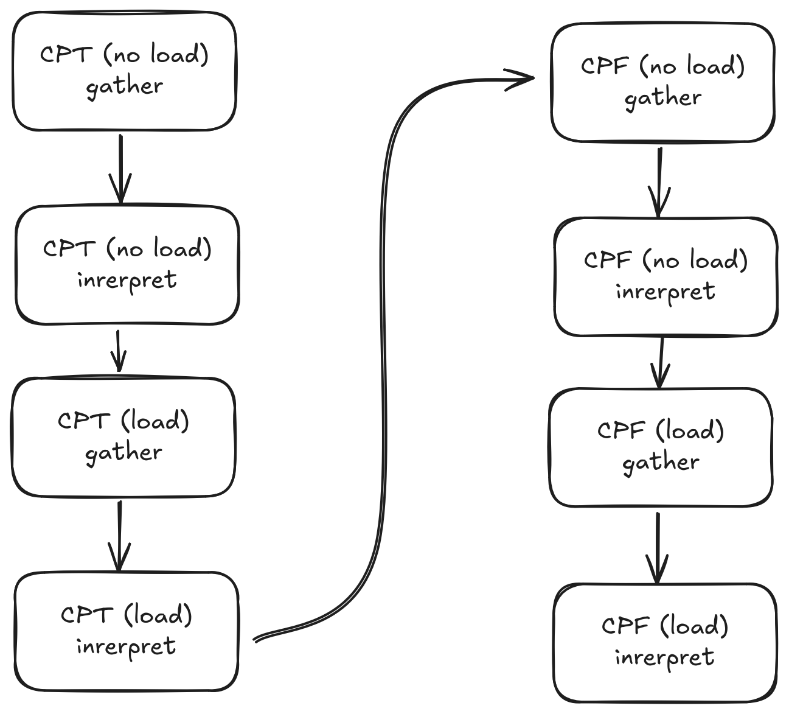
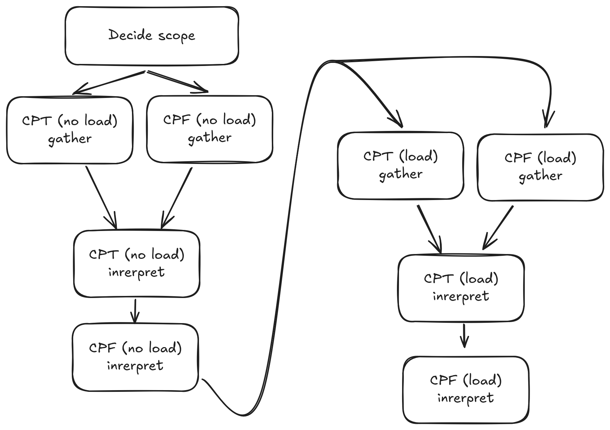

<!--
SPDX-FileCopyrightText: 2025 3mdeb <contact@3mdeb.com>

SPDX-License-Identifier: Apache-2.0
-->
# Concurrent tests

## Introduction

Many test cases in OSFV have the potential to be performed concurrently to save
time. It is especially noticeable among the `dasharo-performance` tests like
`CPT` and `CPF` which measure the CPU temperatures and clock frequencies in
regular intervals.

The tool `pabot` allows running robot tests in parallel, all at the same time,
but it does not offer any solutions for resource sharing and synchronization.

All OSFV tests share a single very important and required on almost every step
resource - the DUT.

This is most apparent when a test needs to perform a reboot, a suspend,
to boot some OS, to enter the setup menu or just access any of them using the
serial console, sharing of which would require complex management between
test runs. If two tests were run at the same time, none of them would pass
because they would interfere with each other.

The document suggests an approach for running multiple tests at the same time
in the simplest way possible, without using external tools and increasing the
complexity more than necessary.

## Sequential test run

The image above shows the traditional way of executing four tests:
- CPT without load
- CPT under load
- CPF without load
- CPF under load

The tests are a good target of converting to concurrent execution, because they
all run in the same environment and have the same requirements
(single OS, with/without load).

To help visualise where the concurrency can be performed, the tests are split
into two phases: `gather`, and `interpret`. It will be important later.

Originally a lot of time would be wasted, because we would run a single of these
tests at a time, when the most of the time of the test is waiting for
measurements interval to pass. That's the `gather` phases.

By identifying that the tests have similar run conditions and the resources
(DUT serial connection) can be shared between the measurements, the tests
can be run concurrently by joining the `gather` phases:

## Concurrent run

The image above visualises how the measurements for multiple test cases can be
performed in the same time, during the same device boot, without changing the
OS or repeating identical test setup all over again.

The identified compatible test cases, which can be run at the same time in this
case are as follows:
- CPT without load + CPT without load
- CPT under load + CPF under load

The data gathering is then followed by interpreting the gathered test data.
The interpretation takes place in the RF Test Cases named the same way as the
original sequential versions to allow for easy interpretations of the results.

The effect of such approach is reducing the total execution time approximately
`2`-fold as both the cost of gathering the test data and reboots is cut in half
by gathering them at the same time.

## Robot Framework limitations

Implementing such testing workflow encounters a limitation in Robot Framework
though. To gather the test data for multiple test cases and not waste time on
gathering useless information, the test scope must somehow be determined before
the gathering starts.

It is impossible for RF code to access the information about which test cases
are to be run though. The test scope of a `robot` execution is defined by, but
not limited to:
- file/directory passed to `robot`
- `-t` flag for filtering test case names
- `-i` flag for filtering test cases by Tags

There were two approaches suggested to solve this:
- create pseudo test cases with the same name as the original ones
    + the test cases would just set some flag informing the gathering step about
    the scope
- create an RF fork that would allow to access that information using a keyword
- use an external tool to intercept the parameters to `robot` and pass them to
  the test cases

The third approach was chosen as it does not cram up the logs with pseudo
test cases and its simple and not invasive to OSFV as the `run.sh` wrapper
for `robot` is already widely used.

## Implementation guide

To implement concurrent test cases:
1. Identify which test cases, or their parts, can be performed at the same time
   and plan the scope of test cases to join:
   + e.g. we can perform one suspend, and in one go check if:
     - M2 drivers work (SMW)
     - network interface works (NET)
     - USB devices are detected (SUD)
     - etc.
2. Import the `lib/concurrent-testing.robot` lib and run
   `Init Concurrent Testing` in suite setup
3. Use `Add Concurrent Test Skip Condition` to create skip conditions for test
   cases that use concurrent data gathering in suite setup.
4. Create a `_CONCURRENT_` pseudo test case, that will `gather` the test data:
   + `Check Concurrent Test Supported`, `Will Concurrent Test Be Run` etc. to
     determine which data needs to be gathered
   + `Set Concurrent Test Outputs` to save the gathered test data and link it to
     a test case
5. Create `interpret` test cases with the name of test case that should
   PASS/FAIL depending on the results of gathered data:
   + `Skip If Concurrent Test Won't Be Run` etc. to skip the test case using the
     skip conditions from the suite setup
   + `Get Concurrent Test Outputs` to get the outputs saved during `gather` step
     and decide on PASS / FAIL
