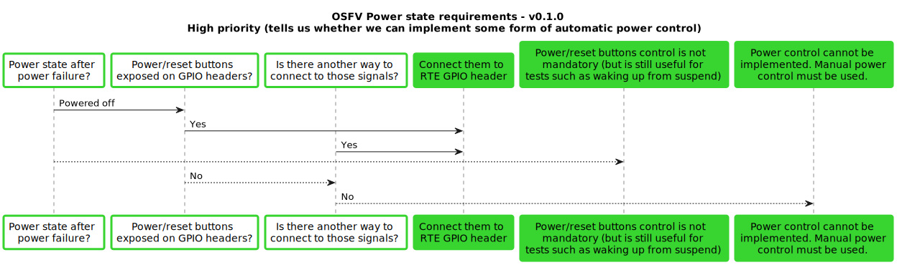
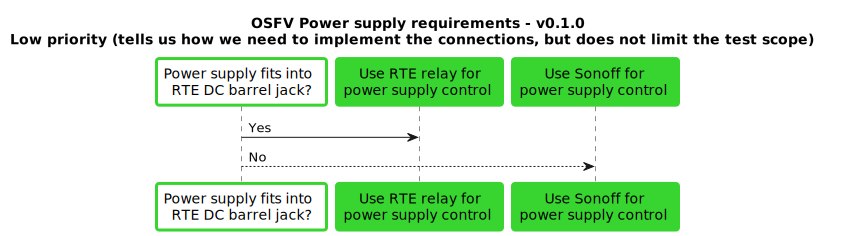
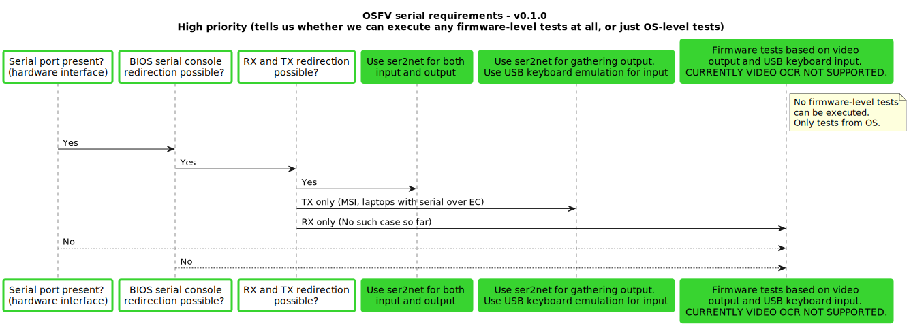

<!--
SPDX-FileCopyrightText: 2024 3mdeb <contact@3mdeb.com>

SPDX-License-Identifier: MIT
-->

# OSFV documentation README

Introducing new platform to the Open Source Firmware Validation infrastructure
requires acquiring crucial parameters of the Device Under Tests (DUT). To
leverage this process, users can refer to the following diagrams and answer the
accompanying questions.

## Power State requirements

## Power Supply requirements

## Serial requirements

