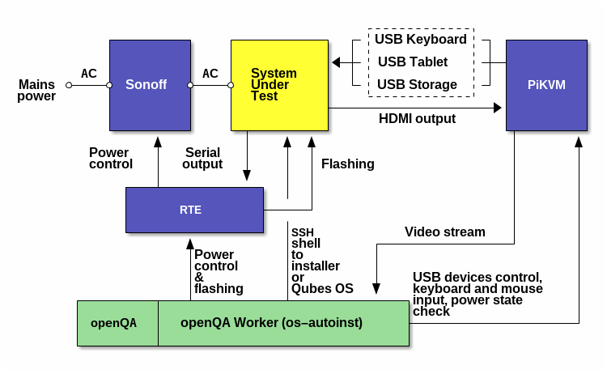

# Configuration for testing of Qubes OS via PiKVM and RTE

.

## openQA part

### workers.ini

Shows an example of how openQA worker's configuration might look like.

### flash/input/power/sol

These are scripts invoked by `generalhw` backend of openQA (really by
`os-autoinst`).

## PiKVM part

Supposed to be copied to PiKVM which is connected to SUT/DUT.

### gadget-control

This script is from Marek's repo [here][gadget-control], but `generalhw` script
calls it so might have a copy at hand.

### generalhw

This script switches OTG input/storage between `gadget-control` and
PiKVM.

### ks.cfg

It's Kickstart configuration file that's fed to Qubes OS installer.

[gadget-control]: https://github.com/QubesOS/tests-hw-setup/blob/aab12ae18820dda692637ef29856f7e53a8221c9/states/openqa-cmds/gadget-control

## Installation

### openQA part

1. Copy `flash`/`input`/`power`/`sol` scripts to openQA server.
2. Update `/etc/openqa/worker.ini` to add a new worker.
3. Update openQA configuration to use a `generalhw` worker.
4. Use `msi-tests` branch of
   <https://github.com/TrenchBoot/openqa-tests-qubesos> for tests distribution.

### PiKVM part

1. Copy `pikvm` directory on PiKVM connected to SUP as `~root/openqa`.
2. Copy `~root/openqa/ks.cfg` to `/etc/kvmd/nginx/`:

   ```bash
   cp ~root/openqa/ks.cfg /etc/kvmd/nginx/
   ```

3. Edit `/etc/kvmd/nginx/nginx.conf` to add:

   ```nginx
   server {
       listen 6789;
       location /ks.cfg {
           root /etc/kvmd/nginx/;
       }
   }
   ```

   Then restart the service:

   ```bash
   systemctl restart kvmd-nginx
   ```

4. Install `socat` and `ffmpeg`:

   ```bash
   pacman -Sy
   pacman -S socat
   pacman -S ffmpeg-rpi # or ffmpeg
   ```

5. Upload test ISO to that PiKVM via its interface (automatic uploading can be
   done via PiKVM API (present and unused in `flash` script) or via SCP, but it
   takes a lot of time and doesn't always work, so not automated).
6. Store EDID modified to use 1024x768 mode as `~root/openqa/edid.1024x768` in
   text format.

### RTE part

1. Flash Dasharo firmware on SUT.
2. Run

   ```bash
   systemctl stop kvmd-otg
   ~root/openqa/gadget-control --storage /var/lib/kvmd/msd/[images]/{your.iso}
   ```

3. Start SUT and modify boot order through PiKVM Web-interface to make
   `marmarek` appear at the top of the list.
4. `systemctl start kvmd-otg`.
5. Store flash image as `/data/openqa-image.rom`.

## Usage

After uploading an ISO, a new job can be posted on openQA server like so:

```bash
openqa-cli api -X POST isos ISO=Qubes-R4.2.0-rc1-x86_64.iso \
                            HDD_1=Qubes-R4.2.0-rc1-x86_64.iso \
                            DISTRI=qubesos \
                            VERSION=4.2 \
                            FLAVOR=install-iso-hw \
                            ARCH=x86_64 \
                            BUILD=4.2.0-rc1 \
                            INSTALL_TEMPLATES=fedora
```
